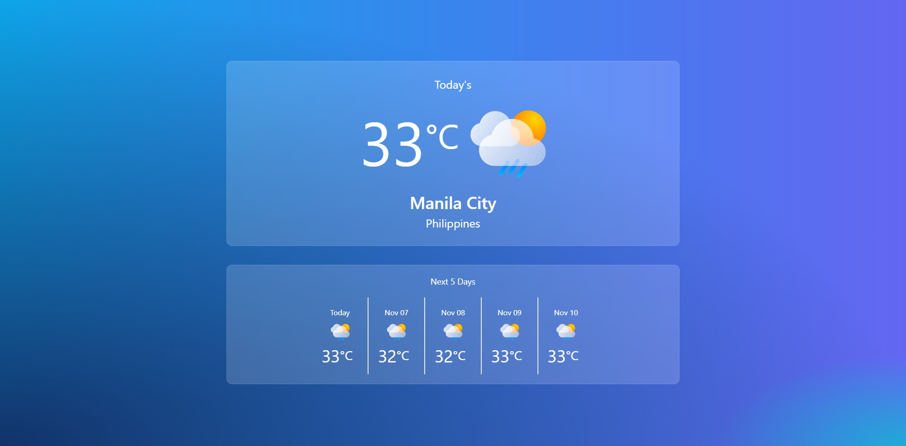

# Weather App



## Live Demo

[](https://weather-forecast-3t49.onrender.com/)

# Weather Forecast App

Welcome to the Weather Forecast App, a web application that provides weather forecasts for various locations. This app helps you plan your activities and stay prepared for different weather conditions.

## Introduction

This Weather Forecast App utilizes the AccuWeather Forecast API to fetch current weather data for a specific city. It's a valuable tool for checking the weather conditions in real-time and planning your activities accordingly.

Please note that to use this app, you will need your own AccuWeather API key and the city's ID for which you want to retrieve weather data. These credentials are required to access the AccuWeather API. We recommend signing up for an AccuWeather API key and exploring their documentation to understand how to obtain the city ID.

### Features

- **5-Day Weather Forecast:** The app provides a 5-day weather forecast for the selected location, giving you an overview of the expected weather conditions in the upcoming days.

- **Search Bar (Coming Soon):** In a future update, we plan to add a search bar feature that will allow you to easily search for any city and retrieve its weather forecast.

## Technologies Used

This project is built using several technologies:


## Getting Started

To run this project locally, follow the steps below.

### Prerequisites

You need to have the following software installed on your machine:

- Node.js: Download and install [Node.js](https://nodejs.org/).

### Installation

1. Clone the repository:

```bash
  git clone https://github.com/your-username/weather-forecast-app.git
```

2. Navigate to the project directory:

```bash
  cd weather-forecast-app
```

3. Install the required dependencies using npm:

```bash
  npm install
```

### Running the Application

1. Start the development server:

```bash
npm start
```

2. Open your web browser and go to http://localhost:3000 to access the Weather Forecast App.

3. Enter a location in the search bar to view the weather forecast for that location.

### Testing

This project includes unit tests for the Weather component using Jest. To run the tests, follow these steps:

1. Run the following command:

```bash
npm test
```

This will run the tests and display the results in your terminal.

### Author

- Name: Annie-Neshreen Ibrahim
- Contact: annie.business04@gmail.com
- GitHub: @hannie404
